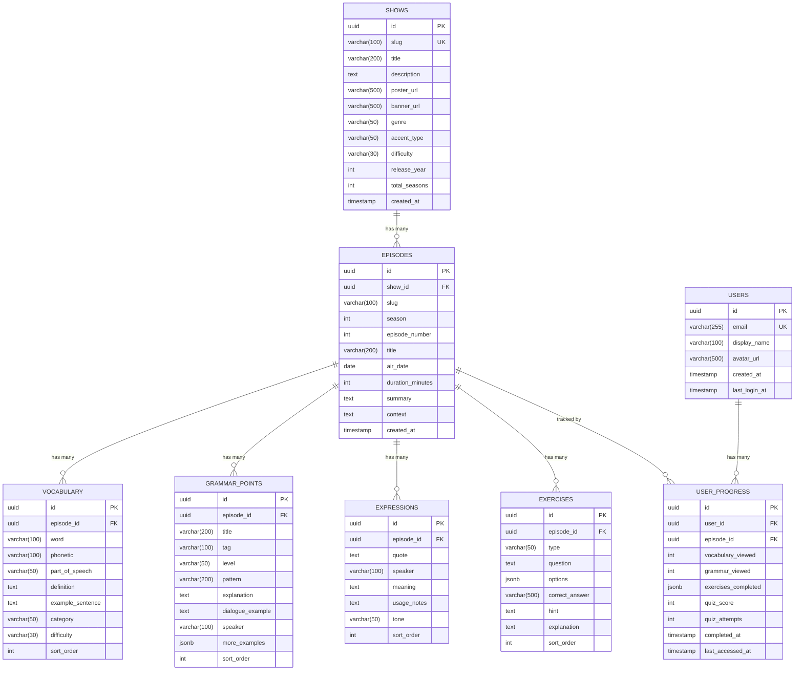

# LearnTV - Backend Planning Document

## Tech Stack

| Layer | Technology |
|-------|------------|
| **Language** | Java 21 |
| **Framework** | Spring Boot 3.2+ |
| **Architecture** | Hexagonal (Ports & Adapters) |
| **Database (Local)** | H2 (in-memory) or PostgreSQL via Docker |
| **Database (Prod)** | Supabase (PostgreSQL) |
| **ORM** | Spring Data JPA + Hibernate |
| **Validation** | Jakarta Validation |
| **API Docs** | SpringDoc OpenAPI (Swagger) |
| **Build** | Gradle (Kotlin DSL) |

---

## 1. Domain Model

### Core Entities


### Enumerations


---

## 2. Database Schema (ERD)



---

## 3. Hexagonal Architecture

### Layer Diagram


### Package Structure

```
com.learntv.api/
├── domain/                           # CORE (no framework dependencies)
│   ├── model/
│   │   ├── show/
│   │   │   ├── Show.java
│   │   │   ├── ShowId.java          # Value Object
│   │   │   ├── Genre.java
│   │   │   └── AccentType.java
│   │   ├── episode/
│   │   │   ├── Episode.java
│   │   │   ├── EpisodeId.java
│   │   │   └── EpisodeContent.java  # Aggregate
│   │   ├── vocabulary/
│   │   │   └── Vocabulary.java
│   │   ├── grammar/
│   │   │   └── GrammarPoint.java
│   │   ├── expression/
│   │   │   └── Expression.java
│   │   ├── exercise/
│   │   │   ├── Exercise.java
│   │   │   └── ExerciseOption.java
│   │   └── user/
│   │       ├── User.java
│   │       └── UserProgress.java
│   └── exception/
│       ├── ShowNotFoundException.java
│       └── EpisodeNotFoundException.java
│
├── application/                      # USE CASES
│   ├── port/
│   │   ├── input/                   # Input Ports (Driving)
│   │   │   ├── GetAllShowsUseCase.java
│   │   │   ├── GetShowBySlugUseCase.java
│   │   │   ├── GetEpisodeLessonUseCase.java
│   │   │   ├── CreateShowUseCase.java
│   │   │   └── SaveUserProgressUseCase.java
│   │   └── output/                  # Output Ports (Driven)
│   │       ├── ShowRepositoryPort.java
│   │       ├── EpisodeRepositoryPort.java
│   │       └── UserProgressRepositoryPort.java
│   └── service/                     # Use Case Implementations
│       ├── ShowService.java
│       ├── EpisodeService.java
│       └── UserProgressService.java
│
└── infrastructure/                   # ADAPTERS
    ├── adapter/
    │   ├── input/
    │   │   └── rest/                # REST Controllers
    │   │       ├── ShowController.java
    │   │       ├── EpisodeController.java
    │   │       ├── ProgressController.java
    │   │       └── dto/
    │   │           ├── ShowResponse.java
    │   │           ├── EpisodeResponse.java
    │   │           ├── LessonResponse.java
    │   │           └── CreateShowRequest.java
    │   └── output/
    │       └── persistence/         # JPA Implementation
    │           ├── entity/
    │           │   ├── ShowJpaEntity.java
    │           │   ├── EpisodeJpaEntity.java
    │           │   └── ...
    │           ├── repository/
    │           │   ├── ShowJpaRepository.java
    │           │   └── EpisodeJpaRepository.java
    │           ├── adapter/
    │           │   ├── ShowRepositoryAdapter.java
    │           │   └── EpisodeRepositoryAdapter.java
    │           └── mapper/
    │               ├── ShowMapper.java
    │               └── EpisodeMapper.java
    └── config/
        ├── BeanConfiguration.java   # Wire use cases
        ├── WebConfig.java
        └── OpenApiConfig.java
```

---

## 4. REST API Design

### Endpoints

```yaml
# Shows
GET    /api/v1/shows                    # List all shows
GET    /api/v1/shows/{slug}             # Get show with episodes
POST   /api/v1/shows                    # Create show (admin)
PUT    /api/v1/shows/{slug}             # Update show (admin)
DELETE /api/v1/shows/{slug}             # Delete show (admin)

# Episodes
GET    /api/v1/shows/{showSlug}/episodes                    # List episodes
GET    /api/v1/shows/{showSlug}/episodes/{episodeSlug}      # Get episode lesson (full content)
POST   /api/v1/shows/{showSlug}/episodes                    # Create episode (admin)
PUT    /api/v1/shows/{showSlug}/episodes/{episodeSlug}      # Update episode (admin)

# Vocabulary (for a specific episode)
GET    /api/v1/episodes/{episodeId}/vocabulary              # List vocabulary
POST   /api/v1/episodes/{episodeId}/vocabulary              # Add vocabulary (admin)

# Grammar Points
GET    /api/v1/episodes/{episodeId}/grammar                 # List grammar points
POST   /api/v1/episodes/{episodeId}/grammar                 # Add grammar point (admin)

# Expressions
GET    /api/v1/episodes/{episodeId}/expressions             # List expressions
POST   /api/v1/episodes/{episodeId}/expressions             # Add expression (admin)

# Exercises
GET    /api/v1/episodes/{episodeId}/exercises               # List exercises
POST   /api/v1/episodes/{episodeId}/exercises               # Add exercise (admin)
POST   /api/v1/exercises/{exerciseId}/check                 # Check answer

# User Progress
GET    /api/v1/users/me/progress                            # Get all progress
GET    /api/v1/users/me/progress/{episodeId}                # Get episode progress
POST   /api/v1/users/me/progress/{episodeId}                # Save progress
```

### Response Examples

```json
// GET /api/v1/shows
{
  "data": [
    {
      "id": "uuid",
      "slug": "the-pitt",
      "title": "The Pitt",
      "description": "Medical drama...",
      "posterUrl": "https://...",
      "genre": "MEDICAL_DRAMA",
      "accentType": "AMERICAN",
      "difficulty": "UPPER_INTERMEDIATE",
      "releaseYear": 2025,
      "totalSeasons": 1,
      "episodeCount": 15
    }
  ],
  "meta": {
    "total": 1,
    "page": 1,
    "pageSize": 20
  }
}
```

```json
// GET /api/v1/shows/the-pitt/episodes/s01e01-7am
{
  "episode": {
    "id": "uuid",
    "slug": "s01e01-7am",
    "season": 1,
    "episodeNumber": 1,
    "title": "7:00 A.M.",
    "summary": "...",
    "context": "...",
    "durationMinutes": 53
  },
  "show": {
    "slug": "the-pitt",
    "title": "The Pitt"
  },
  "vocabulary": [
    {
      "id": "uuid",
      "word": "trauma",
      "phonetic": "/ˈtrɔːmə/",
      "partOfSpeech": "NOUN",
      "definition": "A serious injury...",
      "exampleSentence": "We've got a trauma coming in.",
      "category": "MEDICAL",
      "difficulty": "INTERMEDIATE"
    }
  ],
  "grammarPoints": [...],
  "expressions": [...],
  "exercises": [...]
}
```

---

## 5. Use Cases

### Core Use Cases


### Use Case Details

| Use Case | Actor | Description | Input | Output |
|----------|-------|-------------|-------|--------|
| Browse Shows | User | View catalog of TV shows | Page, filters | List of shows |
| View Show Details | User | See show info + episode list | Show slug | Show + episodes |
| View Episode Lesson | User | Get full lesson content | Show slug, episode slug | All lesson data |
| Complete Exercise | User | Submit exercise answer | Exercise ID, answer | Correct/incorrect + explanation |
| Track Progress | User | Save learning progress | Episode ID, progress data | Saved progress |
| Create Show | Admin | Add new TV show | Show data | Created show |
| Create Episode | Admin | Add episode with content | Episode + vocabulary + grammar + exercises | Created episode |

---

## 6. Sequence Diagrams

### Get Episode Lesson


### Save Progress


---

## 7. Technology Decisions

| Decision | Choice | Reason |
|----------|--------|--------|
| **Java Version** | 21 | LTS, virtual threads, pattern matching |
| **Spring Boot** | 3.2+ | Latest features, Java 21 support |
| **Database Access** | Spring Data JPA | Standard, well-documented |
| **Validation** | Jakarta Validation | Bean validation standard |
| **Mapping** | MapStruct | Compile-time, type-safe |
| **API Docs** | SpringDoc OpenAPI | Auto-generates Swagger UI |
| **Testing** | JUnit 5 + Mockito + Testcontainers | Standard stack |
| **Local DB** | H2 or PostgreSQL (Docker) | Easy setup |
| **Build Tool** | Gradle (Kotlin DSL) | Modern, flexible |

---

## Next Steps

1. [ ] Review and approve this plan
2. [ ] Set up Spring Boot project structure
3. [ ] Implement domain layer (entities, value objects)
4. [ ] Implement application layer (use cases, ports)
5. [ ] Implement infrastructure layer (JPA, REST)
6. [ ] Seed with The Pitt Episode 1 data
7. [ ] Test API with Swagger UI

---

## Questions for You

1. **H2 or PostgreSQL (Docker) for local development?**
   - H2: Zero setup, in-memory
   - PostgreSQL: Closer to production (Supabase)

2. **MapStruct for mapping or manual mappers?**

3. **Any additional entities or features to add now?**
