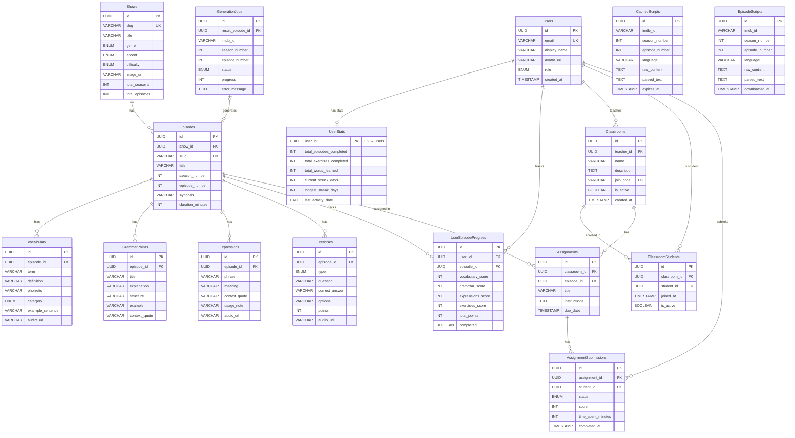

# LearnTV — Entity Relationship Diagram

```mermaid
erDiagram
    %% ─── Catalog ───
    Shows {
        UUID id PK
        VARCHAR slug UK
        VARCHAR title
        ENUM genre
        ENUM accent
        ENUM difficulty
        VARCHAR image_url
        INT total_seasons
        INT total_episodes
    }

    Episodes {
        UUID id PK
        UUID show_id FK
        VARCHAR slug UK
        VARCHAR title
        INT season_number
        INT episode_number
        VARCHAR synopsis
        INT duration_minutes
    }

    %% ─── Learning Content ───
    Vocabulary {
        UUID id PK
        UUID episode_id FK
        VARCHAR term
        VARCHAR definition
        VARCHAR phonetic
        ENUM category
        VARCHAR example_sentence
        VARCHAR audio_url
    }

    GrammarPoints {
        UUID id PK
        UUID episode_id FK
        VARCHAR title
        VARCHAR explanation
        VARCHAR structure
        VARCHAR example
        VARCHAR context_quote
    }

    Expressions {
        UUID id PK
        UUID episode_id FK
        VARCHAR phrase
        VARCHAR meaning
        VARCHAR context_quote
        VARCHAR usage_note
        VARCHAR audio_url
    }

    Exercises {
        UUID id PK
        UUID episode_id FK
        ENUM type
        VARCHAR question
        VARCHAR correct_answer
        VARCHAR options
        INT points
        VARCHAR audio_url
    }

    %% ─── Users & Progress ───
    Users {
        UUID id PK
        VARCHAR email UK
        VARCHAR display_name
        VARCHAR avatar_url
        ENUM role
        TIMESTAMP created_at
    }

    UserStats {
        UUID user_id PK "FK → Users"
        INT total_episodes_completed
        INT total_exercises_completed
        INT total_words_learned
        INT current_streak_days
        INT longest_streak_days
        DATE last_activity_date
    }

    UserEpisodeProgress {
        UUID id PK
        UUID user_id FK
        UUID episode_id FK
        INT vocabulary_score
        INT grammar_score
        INT expressions_score
        INT exercises_score
        INT total_points
        BOOLEAN completed
    }

    %% ─── Classroom ───
    Classrooms {
        UUID id PK
        UUID teacher_id FK
        VARCHAR name
        TEXT description
        VARCHAR join_code UK
        BOOLEAN is_active
        TIMESTAMP created_at
    }

    ClassroomStudents {
        UUID id PK
        UUID classroom_id FK
        UUID student_id FK
        TIMESTAMP joined_at
        BOOLEAN is_active
    }

    Assignments {
        UUID id PK
        UUID classroom_id FK
        UUID episode_id FK
        VARCHAR title
        TEXT instructions
        TIMESTAMP due_date
    }

    AssignmentSubmissions {
        UUID id PK
        UUID assignment_id FK
        UUID student_id FK
        ENUM status
        INT score
        INT time_spent_minutes
        TIMESTAMP completed_at
    }

    %% ─── Generation ───
    GenerationJobs {
        UUID id PK
        UUID result_episode_id FK
        VARCHAR imdb_id
        INT season_number
        INT episode_number
        ENUM status
        INT progress
        TEXT error_message
    }

    CachedScripts {
        UUID id PK
        VARCHAR imdb_id
        INT season_number
        INT episode_number
        VARCHAR language
        TEXT raw_content
        TEXT parsed_text
        TIMESTAMP expires_at
    }

    EpisodeScripts {
        UUID id PK
        VARCHAR imdb_id
        INT season_number
        INT episode_number
        VARCHAR language
        TEXT raw_content
        TEXT parsed_text
        TIMESTAMP downloaded_at
    }

    %% ─── Relationships ───
    Shows ||--o{ Episodes : "has"
    Episodes ||--o{ Vocabulary : "has"
    Episodes ||--o{ GrammarPoints : "has"
    Episodes ||--o{ Expressions : "has"
    Episodes ||--o{ Exercises : "has"
    Episodes ||--o{ UserEpisodeProgress : "tracks"
    Episodes ||--o{ Assignments : "assigned in"

    Users ||--o| UserStats : "has stats"
    Users ||--o{ UserEpisodeProgress : "tracks"
    Users ||--o{ Classrooms : "teaches"
    Users ||--o{ ClassroomStudents : "is student"
    Users ||--o{ AssignmentSubmissions : "submits"

    Classrooms ||--o{ ClassroomStudents : "enrolled in"
    Classrooms ||--o{ Assignments : "has"

    Assignments ||--o{ AssignmentSubmissions : "has"

    GenerationJobs |o--o| Episodes : "generates"
```
